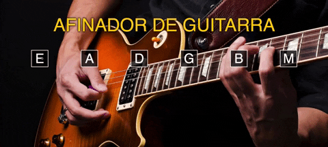

# Afinador Guitarra

O projeto tem objetivo ajudar o músico de guitarra/violão afinar o seu instrumento com o padrão de **seis** cordas.

- E - 6° Corda(Mizona)
- A - 5° Corda(Lá)
- D - 4° Corda(Ré)
- G - 3° Corda(Sol)
- B - 2° Corda(Sí)
- M - 1° Corda(Mizinha)
 

## Imagens

  

 

## Utilização

Para utilizar o afinador, basta apertar as notas **E, A, D, G, B, M(mizinha)** com o mouse ou com as teclas do teclado: ***E, A, D, G, B, M***.

 

Mini projeto simples, com o intúito de melhorar o aprendizado utilizando apenas HTML, CSS e JavaScript.

`made with 💜 by raionedeveloper © 2020`